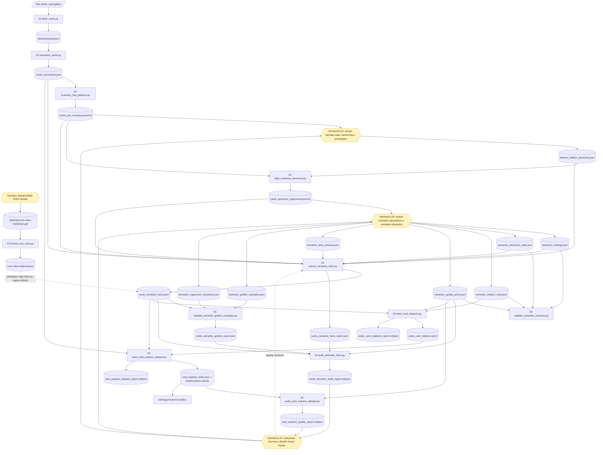

# Riftbound Semantic Card Explorer

Projeto para transformar dados oficiais de cartas e regras de Riftbound em um dataset semântico navegável por um frontend estático.

Entrada global:

- cartas oficiais em `data/raw/cards.json`;
- regras oficiais em PDF, principalmente `data/raw/core-rules-20260330.pdf`.

Saída global:

- frontend em `web/app/`, consumindo `data/processed/web/card_explorer_index.json` e shards em `data/processed/web/relations/`.

Artefatos processados de cartas:

```txt
data/processed/cards/
  normalized/
  inventory/
  semantic/
  relations/
```

## Pipeline

Legenda: caixas retangulares são etapas programáticas; caixas amarelas são decisões, revisões ou inputs humanos/LLM.



## Como Rodar

Instale as dependências conforme a etapa que for executar:

```powershell
pip install -r scripts/01_cards_extraction/requirements.txt
pip install -r scripts/02_rules_formatter/requirements.txt
pip install -r scripts/03_cards_formatter/requirements.txt
```

Gere os artefatos principais:

```powershell
# opcional: atualiza data/raw/cards.json a partir da galeria oficial
python scripts/01_cards_extraction/fetch_cards.py

python scripts/02_rules_formatter/format_core_rules.py
python scripts/03_cards_formatter/normalize_cards.py
python scripts/04_cards_feature_extraction/inventory_text_patterns.py
python scripts/04_cards_feature_extraction/align_inventory_taxonomy.py
python scripts/04_cards_feature_extraction/validate_semantic_contracts.py
python scripts/04_cards_feature_extraction/extract_semantic_facts.py
python scripts/04_cards_feature_extraction/validate_semantic_golden_examples.py
python scripts/04_cards_feature_extraction/audit_semantic_facts.py
python scripts/04_cards_feature_extraction/build_card_relations.py
python scripts/05_web_dataset/build_card_explorer_dataset.py
python scripts/05_web_dataset/audit_card_explorer_dataset.py
```

Sirva o frontend a partir da raiz:

```powershell
python -m http.server 4173 --bind 127.0.0.1
```

Abra `http://127.0.0.1:4173/web/app/`.

## Onde Enriquecer com Humano/LLM

- `feature_relation_taxonomy.json`: revisar se as familias do inventario representam bem os papeis semanticos usados pelo frontend.
- `semantic_ontology.json`: manter IDs canonicos de acoes, eventos, outputs, recursos, zonas e tipos de relacao.
- `semantic_extraction_rules.json`: adicionar regras deterministicas de extracao para linguagem recorrente das cartas.
- `semantic_relation_rules.json`: ajustar familias de relacao, enables, similaridade e sinergia.
- `semantic_quality_policy.json`: controlar auditoria, buckets de blind spot, broad relations e termos de dominio permitidos temporariamente nos parsers.
- `semantic_facts_schema.json`: decidir quais eventos, acoes, recursos, custos e modificadores merecem virar contrato estavel.
- `semantic_golden_examples.json`: adicionar exemplos reais para bloquear regressoes em cartas importantes.
- `semantic_regression_invariants.json`: adicionar fatos proibidos e invariantes de relacao/dataset para bugs conhecidos.
- esses contratos ficam em `scripts/04_cards_feature_extraction/contracts/`.
- relatorios em `data/processed/cards/{inventory,semantic,relations}/*.md` e `data/processed/web/card_explorer_quality_report.md`: priorizar lacunas antes de gerar novas relacoes.
- futuro vínculo fato -> regra oficial: usar `core-rules.json` para explicar ou validar fatos semânticos com base nas regras.

## Estado Atual e Pontos de Atenção

- O frontend atual é estático e não depende de Node/NPM.
- O extractor cobre cerca de `98.4%` das linhas de texto das cartas.
- A validacao dourada atual passa com `73/73` fatos esperados, `90` fixtures de regressao e invariantes verdes.
- A auditoria semantica atual passa com `0` erros e `179` warnings.
- O dataset final atual tem `767` cartas, `6311` fatos e `14590` relacoes.
- A auditoria do frontend aponta `42` cartas sem relacao, `0` cartas apenas com relacoes amplas, `44` cartas com variantes de texto sinalizadas e `0` cartas com linhas relacionais descobertas.
- Os pontos largos atuais sao `spell_card_can_be_countered` e `cost:rune:any`: eles ficam marcados como broad e sao rebaixados/filtrados no frontend por padrao.
- Nao force isolamento zero criando relacoes genericas. Quando a carta ja tem fatos mas segue isolada, trate como desenho de regra de relacao ou scoring.
- `core-rules.json` já existe, mas ainda não está ligado aos fatos das cartas.
- `tournament-rules-20260429.pdf` está arquivado em `data/raw/`, mas não entra no fluxo programático atual.
